# System Architecture Analysis
<!-- generated in 0.00s -->

## Overview

- **Project**: /home/tom/github/tom-sapletta-com/onlyDSL
- **Primary Language**: python
- **Languages**: python: 71, json: 5, shell: 4, yaml: 4, txt: 2
- **Analysis Mode**: static
- **Total Functions**: 486
- **Total Classes**: 107
- **Modules**: 97
- **Entry Points**: 217

## Architecture by Module

### digital_twin
- **Functions**: 50
- **Classes**: 10
- **File**: `digital_twin.py`

### contextdsl
- **Functions**: 39
- **Classes**: 5
- **File**: `contextdsl.py`

### ifuri_core.transport
- **Functions**: 34
- **Classes**: 7
- **File**: `transport.py`

### server
- **Functions**: 30
- **Classes**: 1
- **File**: `server.py`

### intentdsl
- **Functions**: 27
- **Classes**: 4
- **File**: `intentdsl.py`

### evolution
- **Functions**: 18
- **Classes**: 1
- **File**: `evolution.py`

### boundary
- **Functions**: 16
- **Classes**: 2
- **File**: `boundary.py`

### ifuri_core.manifest
- **Functions**: 13
- **Classes**: 5
- **File**: `manifest.py`

### source_ingest
- **Functions**: 13
- **Classes**: 3
- **File**: `source_ingest.py`

### llm_client
- **Functions**: 13
- **Classes**: 1
- **File**: `llm_client.py`

### onlydsl.ssot.writer
- **Functions**: 13
- **Classes**: 1
- **File**: `writer.py`

### onlydsl.ssot.manifest
- **Functions**: 11
- **File**: `manifest.py`

### ifuri_core.llm_gateway
- **Functions**: 10
- **Classes**: 1
- **File**: `llm_gateway.py`

### ifuri_core.event_store
- **Functions**: 10
- **Classes**: 4
- **File**: `event_store.py`

### aql
- **Functions**: 9
- **Classes**: 3
- **File**: `aql.py`

### multiruntime.javascript.ifuri
- **Functions**: 9
- **File**: `ifuri.mjs`

### ifuri_core.postgres_store
- **Functions**: 9
- **Classes**: 1
- **File**: `postgres_store.py`

### ifuri_core.cqrs
- **Functions**: 8
- **Classes**: 2
- **File**: `cqrs.py`

### scripts.startup_testql
- **Functions**: 8
- **File**: `startup_testql.py`

### packages.onlydsl-contracts.src.onlydsl_contracts.dsl.spatial_class
- **Functions**: 8
- **Classes**: 4
- **File**: `spatial_class.py`

## Key Entry Points

Main execution flows into the system:

### onlydsl.ssot.cli.main
- **Calls**: None.parse_args, onlydsl.ssot.cli.build_parser, None.initialize, onlydsl.ssot.cli._json, onlydsl.ssot.cli._json, SsotStore, onlydsl.ssot.cli._json, SsotStore

### onlydsl.ssot.candidate.create_candidate
- **Calls**: directory.exists, candidates_root.mkdir, temporary.exists, temporary.mkdir, onlydsl.ssot.manifest.collect_file_hashes, shutil.copytree, tuple, normalized_updates.items

### onlydsl.ssot.writer.SsotStore.promote
- **Calls**: self._validate_approval, self._promotion_lock, self.verified_manifest, self._candidate_directory, onlydsl.ssot.candidate.load_candidate, onlydsl.ssot.writer.SsotStore.validate_candidate, None.lower, None.lower

### scripts.startup_testql.main
- **Calls**: EvolutionStore, output.mkdir, float, os.getenv, os.getenv, scripts.startup_testql.wait_for, None.strftime, None.write_text

### ifuri_core.manifest.CapabilityRegistry.from_mapping
- **Calls**: cls, int, ManifestError, raw.get, isinstance, caps.append, raw.get, isinstance

### server.Handler.do_GET
- **Calls**: urlparse, self._send, self._send, self._send, EVOLUTION.status, server._application_version, server._twin_status, server.evolution_authority_status

### evolution.EvolutionStore.status
- **Calls**: sorted, next, sum, self.events.glob, evolution._parse_event, str, str, None.lower

### evolution.EvolutionStore.add_incident
- **Calls**: sorted, rows.extend, None.join, self._write, self.add_event, self.add_diagnostic, Path, uuid.uuid4

### ifuri_core.llm_gateway.build_llm_patch_handler
- **Calls**: DslDocument, EnvelopeCodec.unpack, ifuri_core.dsl_document.validate_dsl_document, boundary.assert_dsl_only, _FENCE.finditer, llm_client.propose_code_patch, ifuri_core.llm_gateway._reply, LlmGatewayError

### server.Handler.do_POST
- **Calls**: self._body, None.get, self._send, urlparse, self._send, handler, self._send, EVOLUTION.add_event

### aql.AqlContract.parse
- **Calls**: enumerate, sorted, cls, text.splitlines, raw.strip, line.split, AqlError, AqlError

### ifuri_core.event_store.SqliteEventStore.append
- **Calls**: list, self.conn.cursor, cur.execute, cur.execute, None.fetchone, int, cur.execute, cur.execute

### onlydsl.ssot.writer.SsotStore.initialize
- **Calls**: self.manifest_path.exists, self.current_root.mkdir, source.is_file, onlydsl.ssot.io.atomic_write_text, onlydsl.ssot.io.atomic_write_text, onlydsl.ssot.io.atomic_write_text, onlydsl.ssot.manifest.create_manifest, onlydsl.ssot.manifest.render_manifest

### ifuri_core.envelope.EnvelopeCodec.create
- **Calls**: IfUri.parse, IfUri.parse, EnvelopeCodec._validate_kind_uri, envelope_pb2.Envelope, Timestamp, now.FromMilliseconds, env.created_at.CopyFrom, EnvelopeCodec.validate

### ifuri_core.postgres_store.PostgresEventStore.append
- **Calls**: list, self.conn.transaction, self.conn.cursor, cur.execute, cur.execute, int, cur.execute, int

### contextdsl.ContextCompiler.legacy_log
> Lossy adapter for old text logs. Prefer `event()` at log emission time.
- **Calls**: line.strip, LEGACY_LOG_RE.match, self.record, match.groupdict, KV_RE.sub, contextdsl._event_code_from_text, groups.get, self.record

### packages.onlydsl-contracts.src.onlydsl_contracts.dsl.parameter_contract.ParameterContractDocument.validate
- **Calls**: self.parameters.get, ParameterValidation, ParameterValidation, ParameterValidation, ParameterValidation, ParameterValidation, ParameterValidation, ParameterValidation

### server.Handler._post_routes
- **Calls**: server._compile_context, server._ifuri_analyze_context, server._ifuri_analyze_context, server._ifuri_compile_source, server._ifuri_compile_source, server._bootstrap_twin, server._update_twin, server._integrity_repair_plan

### ifuri_core.transport.NatsTransport.serve_capability
- **Calls**: ifuri_core.transport.capability_pattern_to_subject, self._service_sids.append, self._service_tasks.append, self.client.subscribe, asyncio.create_task, loop, q.get, EnvelopeCodec.parse

### ifuri_core.runtime.IfuriRuntime.emit
- **Calls**: self.registry.resolve, EnvelopeCodec.create, self._validate_payload_contract, list, RouteDecision, RuntimeErrorIfuri, RuntimeErrorIfuri, resolved.capability.transport.ordered

### onlydsl.ssot.candidate.validate_candidate
- **Calls**: onlydsl.ssot.candidate.load_candidate, onlydsl.ssot.validation.validate_tree, list, onlydsl.ssot.manifest.calculate_section_hashes, onlydsl.ssot.manifest.calculate_revision_hash, onlydsl.ssot.diff.calculate_diff, ValidationReport, onlydsl.ssot.io.atomic_write_text

### evolution.EvolutionStore.add_guidance
- **Calls**: None.join, self._write, self.add_event, None.strip, ValueError, uuid.uuid4, str, str

### twin_store.TwinStore.save
- **Calls**: digital_twin.validate_twin_markdown, digital_twin.parse_twindsl, self.exists, None.strftime, hist.write_text, tmp.replace, TwinStoreError, digital_twin.extract_twindsl

### packages.onlydsl-contracts.src.onlydsl_contracts.ifuri.IfUri.parse
- **Calls**: urlsplit, cls, IfUriError, IfUriError, IfUriError, IfUriError, IfUriError, len

### ifuri_core.runtime.IfuriRuntime.call_envelope
- **Calls**: list, RouteDecision, RuntimeErrorIfuri, resolved.capability.transport.ordered, self.transports.get, dict, decision.attempted.append, errors.append

### ifuri_core.llm_gateway.build_llm_build_plan_handler
- **Calls**: DslDocument, EnvelopeCodec.unpack, ifuri_core.dsl_document.validate_dsl_document, llm_client.plan_build, None.parse_twindsl, ifuri_core.llm_gateway._reply, LlmGatewayError, LlmGatewayError

### source_ingest.SourceIndex.to_markdown
- **Calls**: lines.append, lines.extend, lines.append, lines.append, lines.append, lines.append, lines.append, None.join

### ifuri_core.transport.NatsWireClient.connect
- **Calls**: asyncio.create_task, asyncio.open_connection, asyncio.wait_for, info_line.startswith, TransportError, json.loads, self._write, self._reader_loop

### ifuri_core.transport.NatsWireClient._read_message
- **Calls**: header.split, int, int, self._subs.get, len, self.reader.readexactly, self.reader.readexactly, TransportError

### evolution.EvolutionStore.add_event
- **Calls**: sorted, rows.extend, self._write, uuid.uuid4, None.items, rows.append, None.join, evolution._q

## Process Flows

Key execution flows identified:

### Flow 1: main
```
main [onlydsl.ssot.cli]
  └─> build_parser
  └─> _json
```

### Flow 2: create_candidate
```
create_candidate [onlydsl.ssot.candidate]
  └─ →> collect_file_hashes
```

### Flow 3: promote
```
promote [onlydsl.ssot.writer.SsotStore]
  └─ →> load_candidate
      └─> _candidate_from_dict
```

### Flow 4: from_mapping
```
from_mapping [ifuri_core.manifest.CapabilityRegistry]
```

### Flow 5: do_GET
```
do_GET [server.Handler]
```

### Flow 6: status
```
status [evolution.EvolutionStore]
  └─ →> _parse_event
```

### Flow 7: add_incident
```
add_incident [evolution.EvolutionStore]
```

### Flow 8: build_llm_patch_handler
```
build_llm_patch_handler [ifuri_core.llm_gateway]
  └─ →> validate_dsl_document
  └─ →> assert_dsl_only
```

### Flow 9: do_POST
```
do_POST [server.Handler]
```

### Flow 10: parse
```
parse [aql.AqlContract]
```

## Key Classes

### contextdsl.ContextCompiler
> Deterministic application-side compiler. No LLM is called here.
- **Methods**: 15
- **Key Methods**: contextdsl.ContextCompiler.__init__, contextdsl.ContextCompiler.policy, contextdsl.ContextCompiler.capability, contextdsl.ContextCompiler.state, contextdsl.ContextCompiler.metric, contextdsl.ContextCompiler.record, contextdsl.ContextCompiler.event, contextdsl.ContextCompiler.exception, contextdsl.ContextCompiler.tool_result, contextdsl.ContextCompiler.retrieval

### evolution.EvolutionStore
> Filesystem queue whose persisted records are complete, typed DSL documents.
- **Methods**: 14
- **Key Methods**: evolution.EvolutionStore.__init__, evolution.EvolutionStore._write, evolution.EvolutionStore.add_guidance, evolution.EvolutionStore.add_incident, evolution.EvolutionStore.add_diagnostic, evolution.EvolutionStore.add_event, evolution.EvolutionStore.add_json_record, evolution.EvolutionStore.latest_guidance, evolution.EvolutionStore.claim_incident, evolution.EvolutionStore.finish_incident

### onlydsl.ssot.writer.SsotStore
- **Methods**: 13
- **Key Methods**: onlydsl.ssot.writer.SsotStore.__init__, onlydsl.ssot.writer.SsotStore.initialize, onlydsl.ssot.writer.SsotStore.create_candidate, onlydsl.ssot.writer.SsotStore.validate_candidate, onlydsl.ssot.writer.SsotStore.candidate_diff, onlydsl.ssot.writer.SsotStore.promote, onlydsl.ssot.writer.SsotStore._candidate_directory, onlydsl.ssot.writer.SsotStore._history_path, onlydsl.ssot.writer.SsotStore._write_append_only, onlydsl.ssot.writer.SsotStore._write_json_append_only
- **Inherits**: SsotReader

### ifuri_core.transport.NatsWireClient
> Small dependency-free NATS protocol client used by the POC.

It intentionally implements only the pr
- **Methods**: 12
- **Key Methods**: ifuri_core.transport.NatsWireClient.__init__, ifuri_core.transport.NatsWireClient.connect, ifuri_core.transport.NatsWireClient._write, ifuri_core.transport.NatsWireClient.flush, ifuri_core.transport.NatsWireClient.subscribe, ifuri_core.transport.NatsWireClient.unsubscribe, ifuri_core.transport.NatsWireClient.publish, ifuri_core.transport.NatsWireClient.request, ifuri_core.transport.NatsWireClient.close, ifuri_core.transport.NatsWireClient._read_message

### ifuri_core.event_store.SqliteEventStore
> Reference authoritative ES adapter for tests/local POC.

PostgresEventStore implements the same sema
- **Methods**: 10
- **Key Methods**: ifuri_core.event_store.SqliteEventStore.__init__, ifuri_core.event_store.SqliteEventStore._init_schema, ifuri_core.event_store.SqliteEventStore.current_version, ifuri_core.event_store.SqliteEventStore.append, ifuri_core.event_store.SqliteEventStore.load_stream, ifuri_core.event_store.SqliteEventStore.pending_outbox, ifuri_core.event_store.SqliteEventStore.mark_outbox_published, ifuri_core.event_store.SqliteEventStore.mark_outbox_failed, ifuri_core.event_store.SqliteEventStore.outbox_stats, ifuri_core.event_store.SqliteEventStore.close

### ifuri_core.postgres_store.PostgresEventStore
> PostgreSQL authoritative event store + transactional outbox.

`psycopg[binary]` is an optional runti
- **Methods**: 9
- **Key Methods**: ifuri_core.postgres_store.PostgresEventStore.__init__, ifuri_core.postgres_store.PostgresEventStore.current_version, ifuri_core.postgres_store.PostgresEventStore.append, ifuri_core.postgres_store.PostgresEventStore.load_stream, ifuri_core.postgres_store.PostgresEventStore.pending_outbox, ifuri_core.postgres_store.PostgresEventStore.mark_outbox_published, ifuri_core.postgres_store.PostgresEventStore.mark_outbox_failed, ifuri_core.postgres_store.PostgresEventStore.outbox_stats, ifuri_core.postgres_store.PostgresEventStore.close

### aql.AqlContract
> Small compatible reader for Subactor's canonical aql:contract/v1 profile.
- **Methods**: 8
- **Key Methods**: aql.AqlContract.__init__, aql.AqlContract.parse, aql.AqlContract.from_file, aql.AqlContract._matches, aql.AqlContract.decide, aql.AqlContract.require, aql.AqlContract.require_secret_rotation, aql.AqlContract.public_status

### ifuri_core.manifest.CapabilityRegistry
- **Methods**: 7
- **Key Methods**: ifuri_core.manifest.CapabilityRegistry.__init__, ifuri_core.manifest.CapabilityRegistry.register, ifuri_core.manifest.CapabilityRegistry.from_mapping, ifuri_core.manifest.CapabilityRegistry.from_file, ifuri_core.manifest.CapabilityRegistry.resolve, ifuri_core.manifest.CapabilityRegistry.explain, ifuri_core.manifest.CapabilityRegistry.dump

### ifuri_core.envelope.EnvelopeCodec
- **Methods**: 7
- **Key Methods**: ifuri_core.envelope.EnvelopeCodec.create, ifuri_core.envelope.EnvelopeCodec.validate, ifuri_core.envelope.EnvelopeCodec._validate_kind_uri, ifuri_core.envelope.EnvelopeCodec.serialize, ifuri_core.envelope.EnvelopeCodec.parse, ifuri_core.envelope.EnvelopeCodec.unpack, ifuri_core.envelope.EnvelopeCodec.view

### twin_store.TwinStore
- **Methods**: 6
- **Key Methods**: twin_store.TwinStore.__init__, twin_store.TwinStore.exists, twin_store.TwinStore.reset_current, twin_store.TwinStore.load_markdown, twin_store.TwinStore.load, twin_store.TwinStore.save

### ifuri_core.runtime.IfuriRuntime
> Deterministic URI resolver + transport dispatcher.

Domain code sees only logical URI + protobuf pay
- **Methods**: 6
- **Key Methods**: ifuri_core.runtime.IfuriRuntime.__init__, ifuri_core.runtime.IfuriRuntime.inspect_route, ifuri_core.runtime.IfuriRuntime.call, ifuri_core.runtime.IfuriRuntime.call_envelope, ifuri_core.runtime.IfuriRuntime.emit, ifuri_core.runtime.IfuriRuntime._validate_payload_contract

### server.Handler
- **Methods**: 6
- **Key Methods**: server.Handler.log_message, server.Handler._send, server.Handler._body, server.Handler._post_routes, server.Handler.do_GET, server.Handler.do_POST
- **Inherits**: BaseHTTPRequestHandler

### ifuri_core.transport.NatsJetStream
- **Methods**: 6
- **Key Methods**: ifuri_core.transport.NatsJetStream.__init__, ifuri_core.transport.NatsJetStream.create_stream, ifuri_core.transport.NatsJetStream.stream_info, ifuri_core.transport.NatsJetStream.publish, ifuri_core.transport.NatsJetStream.get_message, ifuri_core.transport.NatsJetStream.replay

### ifuri_core.transport.NatsTransport
- **Methods**: 6
- **Key Methods**: ifuri_core.transport.NatsTransport.__init__, ifuri_core.transport.NatsTransport.call, ifuri_core.transport.NatsTransport.publish, ifuri_core.transport.NatsTransport.ensure_event_stream, ifuri_core.transport.NatsTransport.serve_capability, ifuri_core.transport.NatsTransport.stop_services

### ifuri_core.cqrs.AggregateRoot
> Minimal event-sourced aggregate base; domain state changes only by events.
- **Methods**: 5
- **Key Methods**: ifuri_core.cqrs.AggregateRoot.__init__, ifuri_core.cqrs.AggregateRoot.apply, ifuri_core.cqrs.AggregateRoot.load_from_history, ifuri_core.cqrs.AggregateRoot.raise_event, ifuri_core.cqrs.AggregateRoot.pull_uncommitted
- **Inherits**: ABC

### ifuri_core.artifacts.LocalFileArtifactStore
> Maps logical IFURI artifact identity to a safe local file placement.

The returned file:// URI is ph
- **Methods**: 5
- **Key Methods**: ifuri_core.artifacts.LocalFileArtifactStore.__init__, ifuri_core.artifacts.LocalFileArtifactStore._path, ifuri_core.artifacts.LocalFileArtifactStore.put, ifuri_core.artifacts.LocalFileArtifactStore.get, ifuri_core.artifacts.LocalFileArtifactStore.exists

### packages.onlydsl-contracts.src.onlydsl_contracts.ifuri.IfUri
> Location-independent capability URI.

Canonical shape:
  ifuri://<bounded-context>/<entity>/<identit
- **Methods**: 5
- **Key Methods**: packages.onlydsl-contracts.src.onlydsl_contracts.ifuri.IfUri.parse, packages.onlydsl-contracts.src.onlydsl_contracts.ifuri.IfUri.__str__, packages.onlydsl-contracts.src.onlydsl_contracts.ifuri.IfUri.to_subject, packages.onlydsl-contracts.src.onlydsl_contracts.ifuri.IfUri.is_request_reply, packages.onlydsl-contracts.src.onlydsl_contracts.ifuri.IfUri.is_event

### onlydsl.ssot.reader.SsotReader
- **Methods**: 5
- **Key Methods**: onlydsl.ssot.reader.SsotReader.__init__, onlydsl.ssot.reader.SsotReader.manifest, onlydsl.ssot.reader.SsotReader.verified_manifest, onlydsl.ssot.reader.SsotReader.status, onlydsl.ssot.reader.SsotReader.history

### ifuri_core.transport.InProcessTransport
- **Methods**: 5
- **Key Methods**: ifuri_core.transport.InProcessTransport.__init__, ifuri_core.transport.InProcessTransport.register, ifuri_core.transport.InProcessTransport.has_handler, ifuri_core.transport.InProcessTransport.call, ifuri_core.transport.InProcessTransport.publish

### ifuri_core.outbox.OutboxStore
- **Methods**: 3
- **Key Methods**: ifuri_core.outbox.OutboxStore.pending_outbox, ifuri_core.outbox.OutboxStore.mark_outbox_published, ifuri_core.outbox.OutboxStore.mark_outbox_failed
- **Inherits**: Protocol

## Data Transformation Functions

Key functions that process and transform data:

### contextdsl._parse_literal
- **Output to**: raw.strip, re.fullmatch, re.fullmatch, raw.startswith, ContextDslError

### contextdsl._parse_legacy_scalar
- **Output to**: None.strip, raw.lower, re.fullmatch, re.fullmatch, raw.strip

### contextdsl._parse_record_field
- **Output to**: re.fullmatch, ContextDslError, match.group, contextdsl._parse_literal, raw.startswith

### contextdsl._parse_policy
- **Output to**: re.fullmatch, ContextDslError, match.group, match.group

### contextdsl._parse_capability
- **Output to**: re.fullmatch, capabilities.add, ContextDslError, match.group, match.group

### contextdsl._parse_state
- **Output to**: re.fullmatch, ContextDslError, match.group, match.group, contextdsl._parse_literal

### contextdsl._parse_metric
- **Output to**: re.fullmatch, contextdsl._parse_literal, ContextDslError, match.group, isinstance

### contextdsl._parse_record
- **Output to**: re.fullmatch, ContextRecord, ContextDslError, match.group, match.group

### contextdsl._parse_context_declaration
- **Output to**: stripped.startswith, int, stripped.startswith, None.strip, contextdsl._ident

### contextdsl.parse_context_dsl
- **Output to**: dsl.splitlines, enumerate, raw.strip, stripped.startswith, contextdsl._parse_context_declaration

### contextdsl.validate_context_markdown
- **Output to**: contextdsl.parse_context_dsl, errors.append, doc.policies.get, errors.append, doc.policies.get

### evolution._parse_event
- **Output to**: path.read_text, re.search, re.search, re.search, re.findall

### aql.AqlContract.parse
- **Output to**: enumerate, sorted, cls, text.splitlines, raw.strip

### intentdsl._parse_literal
- **Output to**: raw.strip, re.fullmatch, re.fullmatch, IntentDslError, int

### intentdsl._parse_call
- **Output to**: raw.strip, re.fullmatch, re.fullmatch, match.groups, arg_src.strip

### intentdsl._parse_rule_statement
- **Output to**: raw.startswith, None.strip, raw.startswith, intentdsl._parse_call, rule.operations.append

### intentdsl._parse_program_declaration
- **Output to**: stripped.startswith, stripped.startswith, None.strip, IntentDslError, re.fullmatch

### intentdsl.parse_dsl
- **Output to**: dsl.splitlines, enumerate, raw.strip, intentdsl._parse_program_declaration, IntentDslError

### intentdsl._validate_rule_expressions
- **Output to**: intentdsl.expr_names, errors.append, errors.append, None.join, sorted

### intentdsl._validate_rule_runtime_capabilities
- **Output to**: errors.append, errors.append, errors.append

### intentdsl.validate_program
- **Output to**: program.states.items, set, set, set, set

### intentdsl.validate_markdown
- **Output to**: intentdsl.extract_intentdsl, intentdsl.parse_dsl, intentdsl.validate_program, str

### patchdsl._parse_change
- **Output to**: patchdsl._json_string, None.strip, patchdsl._json_string, PatchChange, PatchDslError

### patchdsl.parse_patchdsl
- **Output to**: _FENCE_RE.fullmatch, patchdsl._json_string, PatchDocument, markdown.strip, PatchDslError

### patchdsl._validate_change
- **Output to**: PurePosixPath, None.resolve, patchdsl._count_diff_lines, posix.is_absolute, change.path.startswith

## Behavioral Patterns

### recursion_create_candidate
- **Type**: recursion
- **Confidence**: 0.90
- **Functions**: onlydsl.ssot.writer.SsotStore.create_candidate

### recursion_validate_candidate
- **Type**: recursion
- **Confidence**: 0.90
- **Functions**: onlydsl.ssot.writer.SsotStore.validate_candidate

## Public API Surface

Functions exposed as public API (no underscore prefix):

- `onlydsl.ssot.cli.main` - 62 calls
- `onlydsl.ssot.candidate.create_candidate` - 50 calls
- `onlydsl.ssot.cli.build_parser` - 48 calls
- `onlydsl.ssot.writer.SsotStore.promote` - 48 calls
- `scripts.startup_testql.main` - 42 calls
- `ifuri_core.manifest.CapabilityRegistry.from_mapping` - 39 calls
- `llm_client.update_twin` - 39 calls
- `server.Handler.do_GET` - 37 calls
- `contextdsl.render_context_dsl` - 35 calls
- `evolution.EvolutionStore.status` - 35 calls
- `source_ingest.build_source_index` - 35 calls
- `packages.onlydsl-contracts.src.onlydsl_contracts.dsl.spatial_class.spatial_class_from_twin` - 35 calls
- `packages.onlydsl-contracts.src.onlydsl_contracts.dsl.build_plan.parse_bound_build_plan` - 31 calls
- `intentdsl.run_program` - 30 calls
- `packages.onlydsl-contracts.src.onlydsl_contracts.dsl.assumption.assumptions_from_integrity` - 29 calls
- `evolution.EvolutionStore.add_incident` - 28 calls
- `patchdsl.parse_patchdsl` - 28 calls
- `ifuri_core.llm_gateway.build_llm_patch_handler` - 28 calls
- `llm_client.bootstrap_twin` - 28 calls
- `intentdsl.validate_program` - 27 calls
- `contextdsl.compiler_from_payload` - 25 calls
- `server.Handler.do_POST` - 25 calls
- `aql.AqlContract.parse` - 24 calls
- `ifuri_core.event_store.SqliteEventStore.append` - 23 calls
- `onlydsl.ssot.writer.SsotStore.initialize` - 23 calls
- `ifuri_core.envelope.EnvelopeCodec.create` - 23 calls
- `packages.onlydsl-contracts.src.onlydsl_contracts.dsl.trust.parse_trust_policy` - 22 calls
- `onlydsl.ssot.manifest.parse_manifest` - 22 calls
- `llm_client.plan_build` - 22 calls
- `ifuri_core.postgres_store.PostgresEventStore.append` - 21 calls
- `onlydsl.runtime.integrity.parse_project_integrity` - 21 calls
- `digital_twin.parse_twindsl` - 21 calls
- `packages.onlydsl-contracts.src.onlydsl_contracts.dsl.repair_plan.parse_repair_plan` - 21 calls
- `contextdsl.ContextCompiler.legacy_log` - 20 calls
- `contextdsl.parse_context_dsl` - 20 calls
- `scripts.startup_testql.render_testqldsl` - 20 calls
- `packages.onlydsl-contracts.src.onlydsl_contracts.dsl.parameter_contract.ParameterContractDocument.validate` - 20 calls
- `digital_twin.demo_bootstrap_twin` - 20 calls
- `packages.onlydsl-contracts.src.onlydsl_contracts.dsl.spatial_class.parse_spatial_class` - 19 calls
- `packages.onlydsl-contracts.src.onlydsl_contracts.dsl.evidence_set.parse_evidence_set` - 19 calls

## System Interactions

How components interact:

```mermaid
graph TD
    main --> parse_args
    main --> build_parser
    main --> initialize
    main --> _json
    create_candidate --> exists
    create_candidate --> mkdir
    create_candidate --> collect_file_hashes
    promote --> _validate_approval
    promote --> _promotion_lock
    promote --> verified_manifest
    promote --> _candidate_directory
    promote --> load_candidate
    main --> EvolutionStore
    main --> mkdir
    main --> float
    main --> getenv
    from_mapping --> cls
    from_mapping --> int
    from_mapping --> ManifestError
    from_mapping --> get
    from_mapping --> isinstance
    do_GET --> urlparse
    do_GET --> _send
    do_GET --> status
    status --> sorted
    status --> next
    status --> sum
    status --> glob
    status --> _parse_event
    add_incident --> sorted
```



## Reverse Engineering Guidelines

1. **Entry Points**: Start analysis from the entry points listed above
2. **Core Logic**: Focus on classes with many methods
3. **Data Flow**: Follow data transformation functions
4. **Process Flows**: Use the flow diagrams for execution paths
5. **API Surface**: Public API functions reveal the interface

## Context for LLM

Maintain the identified architectural patterns and public API surface when suggesting changes.