# System Architecture Analysis
<!-- generated in 0.01s -->

## Overview

- **Project**: .
- **Primary Language**: python
- **Languages**: python: 90, yaml: 6, json: 5, shell: 3, txt: 2
- **Analysis Mode**: static
- **Total Functions**: 520
- **Total Classes**: 104
- **Modules**: 113
- **Entry Points**: 220

## Architecture by Module

### digital_twin
- **Functions**: 50
- **Classes**: 2
- **File**: `digital_twin.py`

### contextdsl
- **Functions**: 39
- **Classes**: 5
- **File**: `contextdsl.py`

### ifuri_core.transport
- **Functions**: 32
- **Classes**: 5
- **File**: `transport.py`

### server
- **Functions**: 30
- **Classes**: 1
- **File**: `server.py`

### intentdsl
- **Functions**: 22
- **Classes**: 4
- **File**: `intentdsl.py`

### evolution
- **Functions**: 18
- **Classes**: 1
- **File**: `evolution.py`

### packages.onlydsl-ssot.src.onlydsl_ssot.writer
- **Functions**: 17
- **Classes**: 1
- **File**: `writer.py`

### packages.onlydsl-ssot.src.onlydsl_ssot.manifest
- **Functions**: 16
- **File**: `manifest.py`

### boundary
- **Functions**: 16
- **Classes**: 2
- **File**: `boundary.py`

### llm_client
- **Functions**: 13
- **Classes**: 1
- **File**: `llm_client.py`

### source_ingest
- **Functions**: 13
- **Classes**: 3
- **File**: `source_ingest.py`

### packages.onlydsl-contracts.src.onlydsl_contracts.dsl.development_evidence
- **Functions**: 12
- **Classes**: 1
- **File**: `development_evidence.py`

### packages.onlydsl-core.src.onlydsl_core.capabilities
- **Functions**: 12
- **Classes**: 5
- **File**: `capabilities.py`

### scripts.autonomous_repair
- **Functions**: 11
- **Classes**: 2
- **File**: `autonomous_repair.py`

### ifuri_core.llm_gateway
- **Functions**: 10
- **Classes**: 1
- **File**: `llm_gateway.py`

### ifuri_core.event_store
- **Functions**: 10
- **Classes**: 4
- **File**: `event_store.py`

### packages.onlydsl-contracts.src.onlydsl_contracts.dsl.parameter_contract
- **Functions**: 10
- **Classes**: 3
- **File**: `parameter_contract.py`

### aql
- **Functions**: 9
- **Classes**: 3
- **File**: `aql.py`

### packages.onlydsl-ssot.src.onlydsl_ssot.candidate
- **Functions**: 9
- **File**: `candidate.py`

### scripts.live_supervisor
- **Functions**: 9
- **Classes**: 1
- **File**: `live_supervisor.py`

## Key Entry Points

Main execution flows into the system:

### scripts.docker_integration.main
- **Calls**: CapabilityRegistry.from_file, NatsTransport, IfuriRuntime, Struct, request.update, Struct, EnvelopeCodec.unpack, scripts.docker_integration.connect_postgres

### scripts.autonomous_repair.AutonomousRepairAgent.process_once
- **Calls**: self.store.claim_incident, incident_path.read_text, self.store.add_event, os.getenv, None.split, self.store.diagnostic_for_incident, re.search, re.search

### scripts.startup_testql.main
- **Calls**: EvolutionStore, output.mkdir, float, os.getenv, os.getenv, scripts.startup_testql.wait_for, None.strftime, None.write_text

### scripts.openrouter_smoke.main
- **Calls**: print, CapabilityRegistry.from_file, InProcessTransport, inproc.register, inproc.register, inproc.register, IfuriRuntime, packages.onlydsl-core.src.onlydsl_core.dsl_document.make_dsl_document

### packages.onlydsl-core.src.onlydsl_core.capabilities.CapabilityRegistry.from_mapping
- **Calls**: cls, int, ManifestError, raw.get, isinstance, caps.append, raw.get, isinstance

### server.Handler.do_GET
- **Calls**: urlparse, self._send, self._send, self._send, EVOLUTION.status, server._application_version, server._twin_status, server.evolution_authority_status

### evolution.EvolutionStore.status
- **Calls**: sorted, next, sum, self.events.glob, evolution._parse_event, str, str, None.lower

### evolution.EvolutionStore.add_incident
- **Calls**: sorted, rows.extend, None.join, self._write, self.add_event, self.add_diagnostic, Path, uuid.uuid4

### scripts.autonomous_repair.AutonomousRepairAgent._propose
- **Calls**: re.search, None.join, boundary.assert_dsl_only, CapabilityRegistry.from_file, InProcessTransport, transport.register, IfuriRuntime, asyncio.run

### server.Handler.do_POST
- **Calls**: self._body, None.get, self._send, urlparse, self._send, handler, self._send, EVOLUTION.add_event

### aql.AqlContract.parse
- **Calls**: enumerate, sorted, cls, text.splitlines, raw.strip, line.split, AqlError, AqlError

### packages.onlydsl-ssot.src.onlydsl_ssot.writer.SsotStore.initialize
- **Calls**: self.manifest_path.exists, self.current_root.mkdir, source.is_file, packages.onlydsl-ssot.src.onlydsl_ssot.io.atomic_write_text, packages.onlydsl-ssot.src.onlydsl_ssot.io.atomic_write_text, packages.onlydsl-ssot.src.onlydsl_ssot.io.atomic_write_text, packages.onlydsl-ssot.src.onlydsl_ssot.manifest.create_manifest, packages.onlydsl-ssot.src.onlydsl_ssot.manifest.render_manifest

### scripts.live_supervisor.LiveSupervisor.run
- **Calls**: signal.signal, signal.signal, self._snapshot, self._start, self.store.add_event, time.sleep, self._snapshot, sorted

### packages.onlydsl-core.src.onlydsl_core.envelope.EnvelopeCodec.create
- **Calls**: IfUri.parse, IfUri.parse, EnvelopeCodec._validate_kind_uri, envelope_pb2.Envelope, Timestamp, now.FromMilliseconds, env.created_at.CopyFrom, EnvelopeCodec.validate

### ifuri_core.event_store.SqliteEventStore.append
- **Calls**: list, self.conn.cursor, cur.execute, cur.execute, None.fetchone, int, cur.execute, cur.execute

### packages.onlydsl-ssot.src.onlydsl_ssot.writer.SsotStore._commit_promotion
- **Calls**: packages.onlydsl-ssot.src.onlydsl_ssot.manifest.render_manifest, self.manifest_path.read_text, backup.exists, os.replace, os.replace, packages.onlydsl-ssot.src.onlydsl_ssot.io.fsync_directory, packages.onlydsl-ssot.src.onlydsl_ssot.io.atomic_write_text, self._write_append_only

### packages.onlydsl-ssot.src.onlydsl_ssot.candidate.create_candidate
- **Calls**: directory.exists, packages.onlydsl-ssot.src.onlydsl_ssot.manifest.collect_file_hashes, packages.onlydsl-ssot.src.onlydsl_ssot.candidate._prepare_candidate_tree, ID_RE.fullmatch, SsotValidationError, SsotValidationError, packages.onlydsl-ssot.src.onlydsl_ssot.candidate._apply_candidate_changes, packages.onlydsl-ssot.src.onlydsl_ssot.candidate._validate_candidate_tree

### ifuri_core.postgres_store.PostgresEventStore.append
- **Calls**: list, self.conn.transaction, self.conn.cursor, cur.execute, cur.execute, int, cur.execute, int

### contextdsl.ContextCompiler.legacy_log
> Lossy adapter for old text logs. Prefer `event()` at log emission time.
- **Calls**: line.strip, LEGACY_LOG_RE.match, self.record, match.groupdict, KV_RE.sub, contextdsl._event_code_from_text, groups.get, self.record

### scripts.autonomous_repair.AutonomousRepairAgent.__init__
- **Calls**: None.resolve, None.lower, os.getenv, os.getenv, max, max, os.getenv, AqlContract.from_file

### server.Handler._post_routes
- **Calls**: server._compile_context, server._ifuri_analyze_context, server._ifuri_analyze_context, server._ifuri_compile_source, server._ifuri_compile_source, server._bootstrap_twin, server._update_twin, server._integrity_repair_plan

### ifuri_core.transport.NatsTransport.serve_capability
- **Calls**: ifuri_core.transport.capability_pattern_to_subject, self._service_sids.append, self._service_tasks.append, self.client.subscribe, asyncio.create_task, loop, q.get, EnvelopeCodec.parse

### packages.onlydsl-ssot.src.onlydsl_ssot.candidate.validate_candidate
- **Calls**: packages.onlydsl-ssot.src.onlydsl_ssot.candidate.load_candidate, validator, list, packages.onlydsl-ssot.src.onlydsl_ssot.manifest.calculate_section_hashes, packages.onlydsl-ssot.src.onlydsl_ssot.manifest.calculate_revision_hash, packages.onlydsl-ssot.src.onlydsl_ssot.diff.calculate_diff, ValidationReport, packages.onlydsl-ssot.src.onlydsl_ssot.io.atomic_write_text

### scripts.autonomous_repair.AutonomousRepairAgent._candidate_files
- **Calls**: re.findall, max, raw.lstrip, path.startswith, candidates.append, int, None.resolve, target.read_text

### evolution.EvolutionStore.add_guidance
- **Calls**: None.join, self._write, self.add_event, None.strip, ValueError, uuid.uuid4, str, str

### twin_store.TwinStore.save
- **Calls**: digital_twin.validate_twin_markdown, digital_twin.parse_twindsl, self.exists, None.strftime, hist.write_text, tmp.replace, TwinStoreError, digital_twin.extract_twindsl

### source_ingest.SourceIndex.to_markdown
- **Calls**: lines.append, lines.extend, lines.append, lines.append, lines.append, lines.append, lines.append, None.join

### ifuri_core.transport.NatsWireClient.connect
- **Calls**: asyncio.create_task, asyncio.open_connection, asyncio.wait_for, info_line.startswith, TransportError, json.loads, self._write, self._reader_loop

### ifuri_core.transport.NatsWireClient._read_message
- **Calls**: header.split, int, int, self._subs.get, len, self.reader.readexactly, self.reader.readexactly, TransportError

### evolution.EvolutionStore.add_event
- **Calls**: sorted, rows.extend, self._write, uuid.uuid4, None.items, rows.append, None.join, evolution._q

## Process Flows

Key execution flows identified:

### Flow 1: main
```
main [scripts.docker_integration]
```

### Flow 2: process_once
```
process_once [scripts.autonomous_repair.AutonomousRepairAgent]
```

### Flow 3: from_mapping
```
from_mapping [packages.onlydsl-core.src.onlydsl_core.capabilities.CapabilityRegistry]
```

### Flow 4: do_GET
```
do_GET [server.Handler]
```

### Flow 5: status
```
status [evolution.EvolutionStore]
  └─ →> _parse_event
```

### Flow 6: add_incident
```
add_incident [evolution.EvolutionStore]
```

### Flow 7: _propose
```
_propose [scripts.autonomous_repair.AutonomousRepairAgent]
  └─ →> assert_dsl_only
```

### Flow 8: do_POST
```
do_POST [server.Handler]
```

### Flow 9: parse
```
parse [aql.AqlContract]
```

### Flow 10: initialize
```
initialize [packages.onlydsl-ssot.src.onlydsl_ssot.writer.SsotStore]
  └─ →> atomic_write_text
      └─> atomic_write_bytes
          └─> fsync_directory
  └─ →> atomic_write_text
      └─> atomic_write_bytes
          └─> fsync_directory
```

## Key Classes

### packages.onlydsl-ssot.src.onlydsl_ssot.writer.SsotStore
- **Methods**: 17
- **Key Methods**: packages.onlydsl-ssot.src.onlydsl_ssot.writer.SsotStore.__init__, packages.onlydsl-ssot.src.onlydsl_ssot.writer.SsotStore.initialize, packages.onlydsl-ssot.src.onlydsl_ssot.writer.SsotStore.create_candidate, packages.onlydsl-ssot.src.onlydsl_ssot.writer.SsotStore.validate_candidate, packages.onlydsl-ssot.src.onlydsl_ssot.writer.SsotStore.candidate_diff, packages.onlydsl-ssot.src.onlydsl_ssot.writer.SsotStore.promote, packages.onlydsl-ssot.src.onlydsl_ssot.writer.SsotStore._prepare_promotion, packages.onlydsl-ssot.src.onlydsl_ssot.writer.SsotStore._stage_promotion, packages.onlydsl-ssot.src.onlydsl_ssot.writer.SsotStore._commit_promotion, packages.onlydsl-ssot.src.onlydsl_ssot.writer.SsotStore._promotion_receipt
- **Inherits**: SsotReader

### contextdsl.ContextCompiler
> Deterministic application-side compiler. No LLM is called here.
- **Methods**: 15
- **Key Methods**: contextdsl.ContextCompiler.__init__, contextdsl.ContextCompiler.policy, contextdsl.ContextCompiler.capability, contextdsl.ContextCompiler.state, contextdsl.ContextCompiler.metric, contextdsl.ContextCompiler.record, contextdsl.ContextCompiler.event, contextdsl.ContextCompiler.exception, contextdsl.ContextCompiler.tool_result, contextdsl.ContextCompiler.retrieval

### evolution.EvolutionStore
> Filesystem queue whose persisted records are complete, typed DSL documents.
- **Methods**: 14
- **Key Methods**: evolution.EvolutionStore.__init__, evolution.EvolutionStore._write, evolution.EvolutionStore.add_guidance, evolution.EvolutionStore.add_incident, evolution.EvolutionStore.add_diagnostic, evolution.EvolutionStore.add_event, evolution.EvolutionStore.add_json_record, evolution.EvolutionStore.latest_guidance, evolution.EvolutionStore.claim_incident, evolution.EvolutionStore.finish_incident

### ifuri_core.transport.NatsWireClient
> Small dependency-free NATS protocol client used by the POC.

It intentionally implements only the pr
- **Methods**: 12
- **Key Methods**: ifuri_core.transport.NatsWireClient.__init__, ifuri_core.transport.NatsWireClient.connect, ifuri_core.transport.NatsWireClient._write, ifuri_core.transport.NatsWireClient.flush, ifuri_core.transport.NatsWireClient.subscribe, ifuri_core.transport.NatsWireClient.unsubscribe, ifuri_core.transport.NatsWireClient.publish, ifuri_core.transport.NatsWireClient.request, ifuri_core.transport.NatsWireClient.close, ifuri_core.transport.NatsWireClient._read_message

### scripts.autonomous_repair.AutonomousRepairAgent
- **Methods**: 10
- **Key Methods**: scripts.autonomous_repair.AutonomousRepairAgent.__init__, scripts.autonomous_repair.AutonomousRepairAgent._candidate_files, scripts.autonomous_repair.AutonomousRepairAgent._git_apply, scripts.autonomous_repair.AutonomousRepairAgent._propose, scripts.autonomous_repair.AutonomousRepairAgent._backup, scripts.autonomous_repair.AutonomousRepairAgent._restore, scripts.autonomous_repair.AutonomousRepairAgent._tests, scripts.autonomous_repair.AutonomousRepairAgent._wait_for_health, scripts.autonomous_repair.AutonomousRepairAgent.process_once, scripts.autonomous_repair.AutonomousRepairAgent.run

### ifuri_core.event_store.SqliteEventStore
> Reference authoritative ES adapter for tests/local POC.

PostgresEventStore implements the same sema
- **Methods**: 10
- **Key Methods**: ifuri_core.event_store.SqliteEventStore.__init__, ifuri_core.event_store.SqliteEventStore._init_schema, ifuri_core.event_store.SqliteEventStore.current_version, ifuri_core.event_store.SqliteEventStore.append, ifuri_core.event_store.SqliteEventStore.load_stream, ifuri_core.event_store.SqliteEventStore.pending_outbox, ifuri_core.event_store.SqliteEventStore.mark_outbox_published, ifuri_core.event_store.SqliteEventStore.mark_outbox_failed, ifuri_core.event_store.SqliteEventStore.outbox_stats, ifuri_core.event_store.SqliteEventStore.close

### scripts.live_supervisor.LiveSupervisor
- **Methods**: 9
- **Key Methods**: scripts.live_supervisor.LiveSupervisor.__init__, scripts.live_supervisor.LiveSupervisor._files, scripts.live_supervisor.LiveSupervisor._snapshot, scripts.live_supervisor.LiveSupervisor._capture, scripts.live_supervisor.LiveSupervisor._start, scripts.live_supervisor.LiveSupervisor._stop_child, scripts.live_supervisor.LiveSupervisor._restart, scripts.live_supervisor.LiveSupervisor.shutdown, scripts.live_supervisor.LiveSupervisor.run

### ifuri_core.postgres_store.PostgresEventStore
> PostgreSQL authoritative event store + transactional outbox.

`psycopg[binary]` is an optional runti
- **Methods**: 9
- **Key Methods**: ifuri_core.postgres_store.PostgresEventStore.__init__, ifuri_core.postgres_store.PostgresEventStore.current_version, ifuri_core.postgres_store.PostgresEventStore.append, ifuri_core.postgres_store.PostgresEventStore.load_stream, ifuri_core.postgres_store.PostgresEventStore.pending_outbox, ifuri_core.postgres_store.PostgresEventStore.mark_outbox_published, ifuri_core.postgres_store.PostgresEventStore.mark_outbox_failed, ifuri_core.postgres_store.PostgresEventStore.outbox_stats, ifuri_core.postgres_store.PostgresEventStore.close

### aql.AqlContract
> Small compatible reader for Subactor's canonical aql:contract/v1 profile.
- **Methods**: 8
- **Key Methods**: aql.AqlContract.__init__, aql.AqlContract.parse, aql.AqlContract.from_file, aql.AqlContract._matches, aql.AqlContract.decide, aql.AqlContract.require, aql.AqlContract.require_secret_rotation, aql.AqlContract.public_status

### packages.onlydsl-core.src.onlydsl_core.envelope.EnvelopeCodec
- **Methods**: 7
- **Key Methods**: packages.onlydsl-core.src.onlydsl_core.envelope.EnvelopeCodec.create, packages.onlydsl-core.src.onlydsl_core.envelope.EnvelopeCodec.validate, packages.onlydsl-core.src.onlydsl_core.envelope.EnvelopeCodec._validate_kind_uri, packages.onlydsl-core.src.onlydsl_core.envelope.EnvelopeCodec.serialize, packages.onlydsl-core.src.onlydsl_core.envelope.EnvelopeCodec.parse, packages.onlydsl-core.src.onlydsl_core.envelope.EnvelopeCodec.unpack, packages.onlydsl-core.src.onlydsl_core.envelope.EnvelopeCodec.view

### twin_store.TwinStore
- **Methods**: 6
- **Key Methods**: twin_store.TwinStore.__init__, twin_store.TwinStore.exists, twin_store.TwinStore.reset_current, twin_store.TwinStore.load_markdown, twin_store.TwinStore.load, twin_store.TwinStore.save

### server.Handler
- **Methods**: 6
- **Key Methods**: server.Handler.log_message, server.Handler._send, server.Handler._body, server.Handler._post_routes, server.Handler.do_GET, server.Handler.do_POST
- **Inherits**: BaseHTTPRequestHandler

### packages.onlydsl-core.src.onlydsl_core.capabilities.CapabilityRegistry
- **Methods**: 6
- **Key Methods**: packages.onlydsl-core.src.onlydsl_core.capabilities.CapabilityRegistry.__init__, packages.onlydsl-core.src.onlydsl_core.capabilities.CapabilityRegistry.register, packages.onlydsl-core.src.onlydsl_core.capabilities.CapabilityRegistry.from_mapping, packages.onlydsl-core.src.onlydsl_core.capabilities.CapabilityRegistry.resolve, packages.onlydsl-core.src.onlydsl_core.capabilities.CapabilityRegistry.explain, packages.onlydsl-core.src.onlydsl_core.capabilities.CapabilityRegistry.dump

### ifuri_core.transport.NatsJetStream
- **Methods**: 6
- **Key Methods**: ifuri_core.transport.NatsJetStream.__init__, ifuri_core.transport.NatsJetStream.create_stream, ifuri_core.transport.NatsJetStream.stream_info, ifuri_core.transport.NatsJetStream.publish, ifuri_core.transport.NatsJetStream.get_message, ifuri_core.transport.NatsJetStream.replay

### ifuri_core.transport.NatsTransport
- **Methods**: 6
- **Key Methods**: ifuri_core.transport.NatsTransport.__init__, ifuri_core.transport.NatsTransport.call, ifuri_core.transport.NatsTransport.publish, ifuri_core.transport.NatsTransport.ensure_event_stream, ifuri_core.transport.NatsTransport.serve_capability, ifuri_core.transport.NatsTransport.stop_services

### packages.onlydsl-ssot.src.onlydsl_ssot.reader.SsotReader
- **Methods**: 5
- **Key Methods**: packages.onlydsl-ssot.src.onlydsl_ssot.reader.SsotReader.__init__, packages.onlydsl-ssot.src.onlydsl_ssot.reader.SsotReader.manifest, packages.onlydsl-ssot.src.onlydsl_ssot.reader.SsotReader.verified_manifest, packages.onlydsl-ssot.src.onlydsl_ssot.reader.SsotReader.status, packages.onlydsl-ssot.src.onlydsl_ssot.reader.SsotReader.history

### packages.onlydsl-contracts.src.onlydsl_contracts.ifuri.IfUri
> Location-independent capability URI.

Canonical shape:
  ifuri://<bounded-context>/<entity>/<identit
- **Methods**: 5
- **Key Methods**: packages.onlydsl-contracts.src.onlydsl_contracts.ifuri.IfUri.parse, packages.onlydsl-contracts.src.onlydsl_contracts.ifuri.IfUri.__str__, packages.onlydsl-contracts.src.onlydsl_contracts.ifuri.IfUri.to_subject, packages.onlydsl-contracts.src.onlydsl_contracts.ifuri.IfUri.is_request_reply, packages.onlydsl-contracts.src.onlydsl_contracts.ifuri.IfUri.is_event

### ifuri_core.transport.InProcessTransport
- **Methods**: 5
- **Key Methods**: ifuri_core.transport.InProcessTransport.__init__, ifuri_core.transport.InProcessTransport.register, ifuri_core.transport.InProcessTransport.has_handler, ifuri_core.transport.InProcessTransport.call, ifuri_core.transport.InProcessTransport.publish

### packages.onlydsl-core.src.onlydsl_core.cqrs.AggregateRoot
> Minimal event-sourced aggregate base; domain state changes only by events.
- **Methods**: 5
- **Key Methods**: packages.onlydsl-core.src.onlydsl_core.cqrs.AggregateRoot.__init__, packages.onlydsl-core.src.onlydsl_core.cqrs.AggregateRoot.apply, packages.onlydsl-core.src.onlydsl_core.cqrs.AggregateRoot.load_from_history, packages.onlydsl-core.src.onlydsl_core.cqrs.AggregateRoot.raise_event, packages.onlydsl-core.src.onlydsl_core.cqrs.AggregateRoot.pull_uncommitted
- **Inherits**: ABC

### ifuri_core.artifacts.LocalFileArtifactStore
> Maps logical IFURI artifact identity to a safe local file placement.

The returned file:// URI is ph
- **Methods**: 5
- **Key Methods**: ifuri_core.artifacts.LocalFileArtifactStore.__init__, ifuri_core.artifacts.LocalFileArtifactStore._path, ifuri_core.artifacts.LocalFileArtifactStore.put, ifuri_core.artifacts.LocalFileArtifactStore.get, ifuri_core.artifacts.LocalFileArtifactStore.exists

## Data Transformation Functions

Key functions that process and transform data:

### governance.load_process_pack
- **Output to**: Path, json.loads, None.read_text

### governance.build_process_envelope
- **Output to**: governance.canonical_hash, governance.canonical_hash, sorted, sorted, asdict

### evolution._parse_event
- **Output to**: path.read_text, re.search, re.search, re.search, re.findall

### packages.onlydsl-ssot.src.onlydsl_ssot.writer.SsotStore.validate_candidate
- **Output to**: self.verified_manifest, packages.onlydsl-ssot.src.onlydsl_ssot.writer.SsotStore.validate_candidate, self._candidate_directory

### packages.onlydsl-ssot.src.onlydsl_ssot.writer.SsotStore._validate_approval
- **Output to**: HASH_RE.fullmatch, SsotValidationError, any, SsotValidationError, any

### aql.AqlContract.parse
- **Output to**: enumerate, sorted, cls, text.splitlines, raw.strip

### packages.onlydsl-ssot.src.onlydsl_ssot.registry.parse_registry
- **Output to**: tuple, line.strip, ValueError, shlex.split, entries.append

### packages.onlydsl-ssot.src.onlydsl_ssot.manifest.validate_manifest
- **Output to**: packages.onlydsl-ssot.src.onlydsl_ssot.manifest._validate_manifest_metadata, packages.onlydsl-ssot.src.onlydsl_ssot.manifest._validate_manifest_entries, packages.onlydsl-ssot.src.onlydsl_ssot.manifest.calculate_section_hashes, packages.onlydsl-ssot.src.onlydsl_ssot.manifest._validate_manifest_hashes, any

### packages.onlydsl-ssot.src.onlydsl_ssot.manifest._validate_manifest_metadata
- **Output to**: any, issues.append, issues.append, issues.append, issues.append

### packages.onlydsl-ssot.src.onlydsl_ssot.manifest._validate_manifest_entries
- **Output to**: manifest.sections.items, manifest.files.items, issues.append, HASH_RE.fullmatch

### packages.onlydsl-ssot.src.onlydsl_ssot.manifest._validate_manifest_hashes
- **Output to**: issues.append, packages.onlydsl-ssot.src.onlydsl_ssot.manifest.calculate_revision_hash, issues.append

### packages.onlydsl-ssot.src.onlydsl_ssot.manifest.parse_manifest
- **Output to**: packages.onlydsl-ssot.src.onlydsl_ssot.manifest._parse_manifest_entries, packages.onlydsl-ssot.src.onlydsl_ssot.manifest._validate_manifest_scalars, SsotManifest, packages.onlydsl-ssot.src.onlydsl_ssot.manifest.validate_manifest, line.strip

### packages.onlydsl-ssot.src.onlydsl_ssot.manifest._parse_manifest_entries
- **Output to**: shlex.split, len, SsotValidationError, receipts.append, len

### packages.onlydsl-ssot.src.onlydsl_ssot.manifest._validate_manifest_scalars
- **Output to**: SsotValidationError, set, scalars.get

### packages.onlydsl-ssot.src.onlydsl_ssot.candidate._validate_candidate_tree
- **Output to**: validator, SsotValidationError, issue.startswith, None.join

### packages.onlydsl-ssot.src.onlydsl_ssot.candidate._validate_candidate_evidence
- **Output to**: tuple, any, dict.fromkeys, SsotValidationError, packages.onlydsl-ssot.src.onlydsl_ssot.manifest.is_immutable_urn

### packages.onlydsl-ssot.src.onlydsl_ssot.candidate.validate_candidate
- **Output to**: packages.onlydsl-ssot.src.onlydsl_ssot.candidate.load_candidate, validator, list, packages.onlydsl-ssot.src.onlydsl_ssot.manifest.calculate_section_hashes, packages.onlydsl-ssot.src.onlydsl_ssot.manifest.calculate_revision_hash

### scripts.autonomous_repair.AutonomousRepairAgent.process_once
- **Output to**: self.store.claim_incident, incident_path.read_text, self.store.add_event, os.getenv, None.split

### packages.onlydsl-core.src.onlydsl_core.dsl_document.validate_dsl_document
- **Output to**: None.hexdigest, DslDocumentError, DslDocumentError, DslDocumentError, hashlib.sha256

### boundary.DslBundle.validate_for_llm
- **Output to**: boundary.assert_dsl_only

### patchdsl._parse_change
- **Output to**: patchdsl._json_string, None.strip, patchdsl._json_string, PatchChange, PatchDslError

### patchdsl.parse_patchdsl
- **Output to**: _FENCE_RE.fullmatch, patchdsl._json_string, PatchDocument, markdown.strip, PatchDslError

### patchdsl._validate_change
- **Output to**: PurePosixPath, None.resolve, patchdsl._count_diff_lines, posix.is_absolute, change.path.startswith

### patchdsl.validate_patch_policy
- **Output to**: None.resolve, patchdsl._validate_change, errors.extend, errors.append, Path

### patchdsl.validate_patch_markdown
- **Output to**: patchdsl.parse_patchdsl, patchdsl.validate_patch_policy, str

## Behavioral Patterns

### recursion_create_candidate
- **Type**: recursion
- **Confidence**: 0.90
- **Functions**: packages.onlydsl-ssot.src.onlydsl_ssot.writer.SsotStore.create_candidate

### recursion_validate_candidate
- **Type**: recursion
- **Confidence**: 0.90
- **Functions**: packages.onlydsl-ssot.src.onlydsl_ssot.writer.SsotStore.validate_candidate

## Public API Surface

Functions exposed as public API (no underscore prefix):

- `scripts.docker_integration.main` - 88 calls
- `scripts.autonomous_repair.AutonomousRepairAgent.process_once` - 51 calls
- `onlydsl.ssot.cli.build_parser` - 48 calls
- `scripts.startup_testql.main` - 42 calls
- `scripts.openrouter_smoke.main` - 41 calls
- `llm_client.update_twin` - 39 calls
- `packages.onlydsl-core.src.onlydsl_core.capabilities.CapabilityRegistry.from_mapping` - 39 calls
- `server.Handler.do_GET` - 37 calls
- `evolution.EvolutionStore.status` - 35 calls
- `contextdsl.render_context_dsl` - 35 calls
- `source_ingest.build_source_index` - 35 calls
- `packages.onlydsl-contracts.src.onlydsl_contracts.dsl.spatial_class.spatial_class_from_twin` - 35 calls
- `intentdsl.run_program` - 30 calls
- `packages.onlydsl-contracts.src.onlydsl_contracts.dsl.assumption.assumptions_from_integrity` - 29 calls
- `evolution.EvolutionStore.add_incident` - 28 calls
- `patchdsl.parse_patchdsl` - 28 calls
- `llm_client.bootstrap_twin` - 28 calls
- `ifuri_core.llm_gateway.build_llm_patch_handler` - 28 calls
- `intentdsl.validate_program` - 27 calls
- `contextdsl.compiler_from_payload` - 25 calls
- `server.Handler.do_POST` - 25 calls
- `aql.AqlContract.parse` - 24 calls
- `packages.onlydsl-ssot.src.onlydsl_ssot.writer.SsotStore.initialize` - 23 calls
- `scripts.live_supervisor.LiveSupervisor.run` - 23 calls
- `packages.onlydsl-core.src.onlydsl_core.envelope.EnvelopeCodec.create` - 23 calls
- `ifuri_core.event_store.SqliteEventStore.append` - 23 calls
- `packages.onlydsl-ssot.src.onlydsl_ssot.candidate.create_candidate` - 22 calls
- `llm_client.plan_build` - 22 calls
- `packages.onlydsl-contracts.src.onlydsl_contracts.dsl.repair_plan.parse_repair_plan` - 21 calls
- `digital_twin.parse_twindsl` - 21 calls
- `ifuri_core.postgres_store.PostgresEventStore.append` - 21 calls
- `scripts.startup_testql.render_testqldsl` - 20 calls
- `contextdsl.ContextCompiler.legacy_log` - 20 calls
- `contextdsl.parse_context_dsl` - 20 calls
- `digital_twin.demo_bootstrap_twin` - 20 calls
- `packages.onlydsl-contracts.src.onlydsl_contracts.dsl.evidence_set.parse_evidence_set` - 19 calls
- `digital_twin.render_twin` - 19 calls
- `ifuri_core.transport.NatsTransport.serve_capability` - 19 calls
- `packages.onlydsl-contracts.src.onlydsl_contracts.dsl.spatial_class.parse_spatial_class` - 19 calls
- `packages.onlydsl-contracts.src.onlydsl_contracts.dsl.claim.parse_claims` - 19 calls

## System Interactions

How components interact:

```mermaid
graph TD
    main --> from_file
    main --> NatsTransport
    main --> IfuriRuntime
    main --> Struct
    main --> update
    process_once --> claim_incident
    process_once --> read_text
    process_once --> add_event
    process_once --> getenv
    process_once --> split
    main --> EvolutionStore
    main --> mkdir
    main --> float
    main --> getenv
    main --> print
    main --> InProcessTransport
    main --> register
    from_mapping --> cls
    from_mapping --> int
    from_mapping --> ManifestError
    from_mapping --> get
    from_mapping --> isinstance
    do_GET --> urlparse
    do_GET --> _send
    do_GET --> status
    status --> sorted
    status --> next
    status --> sum
    status --> glob
    status --> _parse_event
```



## Reverse Engineering Guidelines

1. **Entry Points**: Start analysis from the entry points listed above
2. **Core Logic**: Focus on classes with many methods
3. **Data Flow**: Follow data transformation functions
4. **Process Flows**: Use the flow diagrams for execution paths
5. **API Surface**: Public API functions reveal the interface

## Context for LLM

Maintain the identified architectural patterns and public API surface when suggesting changes.